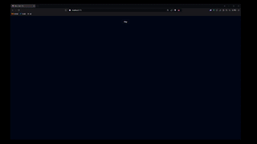

## Boomfunk

Basic beat detection & animation lab.

<div style="text-align:center">
  
</div>

- [Install](###install)
- [Dev](###run-dev)
- [Build](###build)


### Install

> install `pnpm` if not installed
```
npm i -g pnpm
```

> install `npm` dependencies
```bash
pnpm i
```


### Run dev
```bash
pnpm dev
```


### Build
```bash
pnpm build
```


